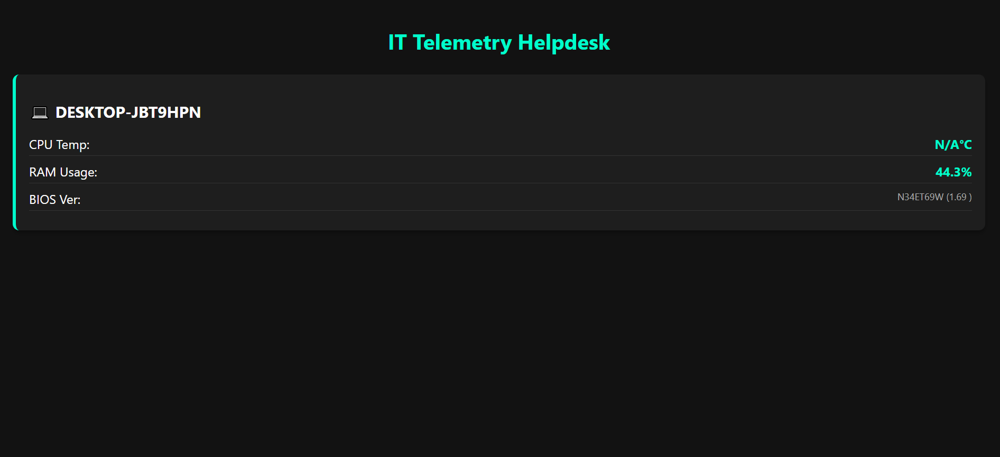

# IT Asset & Telemetry Helpdesk

A lightweight, real-time hardware monitoring system built with Python and FastAPI. This project utilizes a background desktop agent to stream live hardware telemetry—including CPU thermals, RAM utilization, and BIOS information—directly to a centralized IT Helpdesk dashboard via asynchronous WebSockets.

 
*(Note: Rename your screenshot file to `screenshot.png` and place it in the same folder as this README, or update the filename in these brackets)*

## Architecture
* **Agent:** A silent Python executable running on client machines using `psutil` and `wmi`.
* **Server:** A FastAPI backend managing concurrent WebSocket connections across the network.
* **Dashboard:** A dynamic, dark-mode vanilla HTML/JS interface that instantly visualizes incoming telemetry data.

---

## Deployment Guide (Cross-Network Setup)

To monitor other computers on your local network, you must host the server on a main computer, open the necessary network ports, and deploy the agent as an executable to the target PCs.

### 1. Find the Main Computer's IP Address
Target computers need to know where to send their data. Find the IP address of the main computer hosting the dashboard:
1. Open Command Prompt (`cmd`).
2. Type `ipconfig` and press **Enter**.
3. Look for the **IPv4 Address** under your active network adapter (it will typically look like `192.168.x.x`). Write this address down.

### 2. Configure the Agent
Before packaging the agent, point it to your main computer's IP address.
1. Open `agent.py`.
2. Change the WebSocket URI to match your IPv4 address:
   ```python
   uri = "ws://192.168.x.x:8000/ws/telemetry"
   ```

### 3. Open Windows Firewall Port (Main Computer)
Windows blocks outside network traffic by default. You must open Port 8000 on the main computer to receive incoming telemetry data:
1. Press the Windows Key, type Windows Defender Firewall with Advanced Security, and press Enter.
2. On the left panel, click Inbound Rules.
3. On the right panel, click New Rule...
4. Select Port and click Next.
5. Select TCP and type 8000 into the Specific local ports field. Click Next.
6. Select Allow the connection and click Next.
7. Leave Domain, Private, and Public checked. Click Next.
8. Name the rule IT Telemetry Server and click Finish.

### 4. Package the Agent into an Executable (.exe)
Convert the Python script into a standalone executable so target computers do not need Python installed to run it.
1. Open your terminal in the project directory.
2. Install PyInstaller:
  ```Bash
  pip install pyinstaller
  ```
3. Compile the agent:
  ```Bash
  pyinstaller --onefile --noconsole agent.py
  ```
4. PyInstaller will create a dist/ folder. Inside, you will find agent.exe. The --noconsole flag ensures it runs completely invisibly in the background.

### 5. Launch the System
1. Start the Server: On your main computer, open a terminal and run the server, allowing all network interfaces (0.0.0.0):
 ```Bash
  python -m uvicorn server:app --host 0.0.0.0 --port 8000
  ```
2. Open Dashboard: Navigate to http://127.0.0.1:8000 in your main computer's web browser.  
3. Deploy Agent: Copy agent.exe to any target Windows computer on the same network (via USB or network share) and double-click it.
Within seconds, the target PC will automatically populate on your main computer's dashboard with its live hardware telemetry.
<FollowUp label="Want to add a troubleshooting section?" query="Let's add a troubleshooting section to the README to help users resolve common issues like blocked WMI sensors or firewall drops."/>
